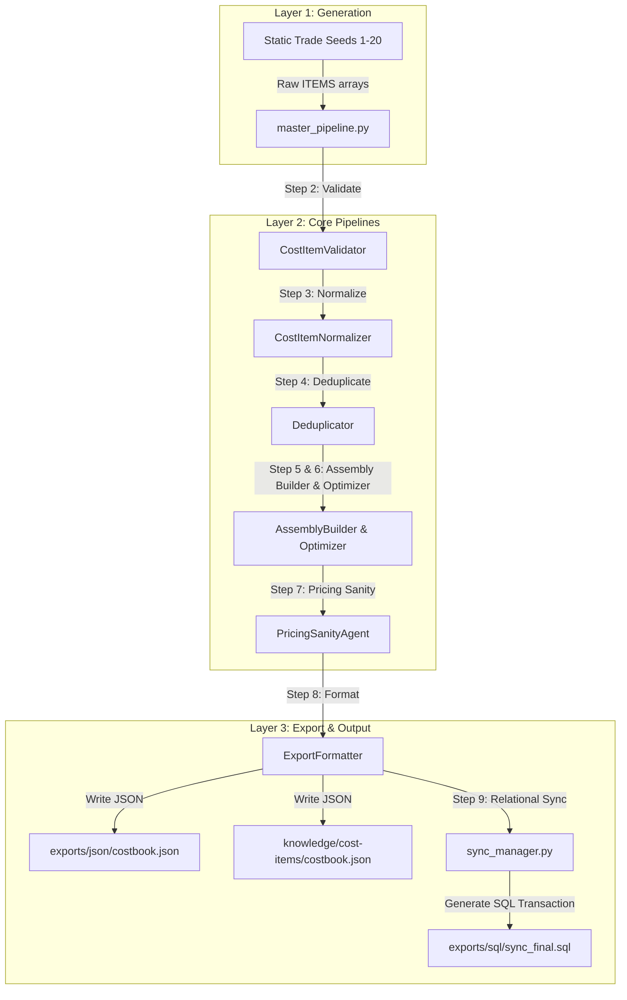

# TradeOS Construction Knowledge Engine - Agent & Pipeline Audit Report

This report presents a comprehensive audit of all existing agents, scripts, prompts, skills, and pipeline files behaving as agents within the TradeOS Costbook Lab environment.

---

## 📊 Agent & Component Inventory

| Component / Agent Name | File Path | Primary Domain | Maturity | Migration Action | Type |
|------------------------|-----------|----------------|----------|------------------|------|
| **Master Orchestrator** | [master_pipeline.py](file:///Users/showb/TradeOS%20Costbook%20Editor/pipelines/master_pipeline.py) | Full Orchestration | **IMPROVE** | Keep & align with prompts | Orchestrator Script |
| **Relational Synchronizer** | [sync_manager.py](file:///Users/showb/TradeOS%20Costbook%20Editor/pipelines/export/sync_manager.py) | Database Sync | **KEEP** | Keep in export pipeline | Export / DB Tool |
| **Supabase Publisher** | [publish_to_supabase.py](file:///Users/showb/TradeOS%20Costbook%20Editor/pipelines/export/publish_to_supabase.py) | Database Sync | **IMPROVE** | Align output path | Export / DB Tool |
| **Assembly Agents Builder** | [assembly_agents.py](file:///Users/showb/TradeOS%20Costbook%20Editor/pipelines/generation/seeds/assemblies/assembly_agents.py) | Assemblies | **REWRITE** | Convert to dynamic builder | Assembly Builder |
| **Tree Service Generator** | [generate_tree_service.py](file:///Users/showb/TradeOS%20Costbook%20Editor/pipelines/generation/generate_tree_service.py) | Tree Service | **KEEP** | Keep as seed generator | Static Generator |
| **Framing Agent** | [framing_agent.py](file:///Users/showb/TradeOS%20Costbook%20Editor/pipelines/generation/seeds/structural/framing_agent.py) | Framing | **IMPROVE** | Migrate to static seed | Static Item Seed |
| **Concrete Agent** | [concrete_agent.py](file:///Users/showb/TradeOS%20Costbook%20Editor/pipelines/generation/seeds/structural/concrete_agent.py) | Concrete | **IMPROVE** | Migrate to static seed | Static Item Seed |
| **Excavation Agent** | [excavation_agent.py](file:///Users/showb/TradeOS%20Costbook%20Editor/pipelines/generation/seeds/structural/excavation_agent.py) | Excavation | **IMPROVE** | Migrate to static seed | Static Item Seed |
| **Roofing Agent** | [roofing_agent.py](file:///Users/showb/TradeOS%20Costbook%20Editor/pipelines/generation/seeds/envelope/roofing_agent.py) | Roofing | **IMPROVE** | Migrate to static seed | Static Item Seed |
| **Siding Agent** | [siding_agent.py](file:///Users/showb/TradeOS%20Costbook%20Editor/pipelines/generation/seeds/envelope/siding_agent.py) | Siding | **IMPROVE** | Migrate to static seed | Static Item Seed |
| **Insulation Agent** | [insulation_agent.py](file:///Users/showb/TradeOS%20Costbook%20Editor/pipelines/generation/seeds/envelope/insulation_agent.py) | Insulation | **IMPROVE** | Migrate to static seed | Static Item Seed |
| **Windows & Doors Agent** | [windows_doors_agent.py](file:///Users/showb/TradeOS%20Costbook%20Editor/pipelines/generation/seeds/envelope/windows_doors_agent.py) | Envelope | **IMPROVE** | Migrate to static seed | Static Item Seed |
| **Electrical Agent** | [electrical_agent.py](file:///Users/showb/TradeOS%20Costbook%20Editor/pipelines/generation/seeds/mep/electrical_agent.py) | Electrical | **IMPROVE** | Migrate to static seed | Static Item Seed |
| **Plumbing Agent** | [plumbing_agent.py](file:///Users/showb/TradeOS%20Costbook%20Editor/pipelines/generation/seeds/mep/plumbing_agent.py) | Plumbing | **IMPROVE** | Migrate to static seed | Static Item Seed |
| **HVAC Agent** | [hvac_agent.py](file:///Users/showb/TradeOS%20Costbook%20Editor/pipelines/generation/seeds/mep/hvac_agent.py) | HVAC | **IMPROVE** | Migrate to static seed | Static Item Seed |
| **Drywall Agent** | [drywall_agent.py](file:///Users/showb/TradeOS%20Costbook%20Editor/pipelines/generation/seeds/interior/drywall_agent.py) | Drywall | **IMPROVE** | Migrate to static seed | Static Item Seed |
| **Painting Agent** | [painting_agent.py](file:///Users/showb/TradeOS%20Costbook%20Editor/pipelines/generation/seeds/interior/painting_agent.py) | Painting | **IMPROVE** | Migrate to static seed | Static Item Seed |
| **Flooring Agent** | [flooring_agent.py](file:///Users/showb/TradeOS%20Costbook%20Editor/pipelines/generation/seeds/interior/flooring_agent.py) | Flooring | **IMPROVE** | Migrate to static seed | Static Item Seed |
| **Trim Agent** | [trim_agent.py](file:///Users/showb/TradeOS%20Costbook%20Editor/pipelines/generation/seeds/interior/trim_agent.py) | Trim | **IMPROVE** | Migrate to static seed | Static Item Seed |
| **Cabinetry Agent** | [cabinetry_agent.py](file:///Users/showb/TradeOS%20Costbook%20Editor/pipelines/generation/seeds/interior/cabinetry_agent.py) | Cabinetry | **IMPROVE** | Migrate to static seed | Static Item Seed |
| **Deck Agent** | [deck_agent.py](file:///Users/showb/TradeOS%20Costbook%20Editor/pipelines/generation/seeds/exterior/deck_agent.py) | Exterior | **IMPROVE** | Migrate to static seed | Static Item Seed |
| **Fence Agent** | [fence_agent.py](file:///Users/showb/TradeOS%20Costbook%20Editor/pipelines/generation/seeds/exterior/fence_agent.py) | Exterior | **IMPROVE** | Migrate to static seed | Static Item Seed |
| **Flatwork Agent** | [flatwork_agent.py](file:///Users/showb/TradeOS%20Costbook%20Editor/pipelines/generation/seeds/exterior/flatwork_agent.py) | Exterior | **IMPROVE** | Migrate to static seed | Static Item Seed |
| **Landscaping Agent** | [landscaping_agent.py](file:///Users/showb/TradeOS%20Costbook%20Editor/pipelines/generation/seeds/exterior/landscaping_agent.py) | Exterior | **IMPROVE** | Migrate to static seed | Static Item Seed |
| **General Conditions Agent** | [general_conditions_agent.py](file:///Users/showb/TradeOS%20Costbook%20Editor/pipelines/generation/seeds/general/general_conditions_agent.py) | General | **IMPROVE** | Migrate to static seed | Static Item Seed |
| **Validating Items Skill** | [SKILL.md](file:///Users/showb/TradeOS%20Costbook%20Editor/.agent/skills/validating-costbook-items/SKILL.md) | Validation | **KEEP** | Standardize for agent context | Agent Skill |
| **Normalizing Items Skill** | [SKILL.md](file:///Users/showb/TradeOS%20Costbook%20Editor/.agent/skills/normalizing-costbook-items/SKILL.md) | Normalization | **KEEP** | Standardize for agent context | Agent Skill |
| **Deduplicating Items Skill** | [SKILL.md](file:///Users/showb/TradeOS%20Costbook%20Editor/.agent/skills/deduplicating-costbook-items/SKILL.md) | Deduplication | **KEEP** | Standardize for agent context | Agent Skill |
| **Pricing Sanity Skill** | [SKILL.md](file:///Users/showb/TradeOS%20Costbook%20Editor/.agent/skills/checking-pricing-sanity/SKILL.md) | Sanity check | **KEEP** | Standardize for agent context | Agent Skill |
| **Generating Items Skill** | [SKILL.md](file:///Users/showb/TradeOS%20Costbook%20Editor/.agent/skills/generating-costbook-items/SKILL.md) | Item Gen | **KEEP** | Standardize for agent context | Agent Skill |

---

## 🔄 Existing Workflow Diagram

The Mermaid diagram below shows the flow of data through the current script-driven system:



---

## 🔍 Detailed Component Audit

### 1. Master Orchestrator (`master_pipeline.py`)
* **Purpose**: Coordinates the execution sequence of the steps, acting as a procedural driver.
* **Input Files**: None directly (imports python array lists from the specialized subfolders).
* **Output Files**: `exports/json/costbook.json`, `knowledge/cost-items/costbook.json`, and triggers `sync_manager.py` to write `exports/sql/sync_final.sql`.
* **Covered Domain**: High-level workflow orchestration.
* **Generates**: Final exports and data logs.
* **Maturity / Migration Value**: **IMPROVE**. It runs perfectly, but the validation, normalization, and deduplication logic are hardcoded directly into the driver script.
* **Knowledge Engine Change**: In the future, the code logic should be modularized, and the orchestrator should serve as a supervisor calling specialized worker agent microservices or standalone Python files rather than carrying all logic in a single monolith.

### 2. Static Trade Seed Agents (e.g. `concrete_agent.py`, `drywall_agent.py`, etc.)
* **Purpose**: Provides pre-generated item databases representing specific trades.
* **Input Files**: None.
* **Output Files**: None (exposes python `ITEMS` array).
* **Covered Domain**: Individual trades (Framing, Concrete, HVAC, Drywall, etc.).
* **Generates**: Cost Items.
* **Maturity / Migration Value**: **IMPROVE**. They are currently static arrays rather than active generation agents. They serve as excellent initial bootstrap seeds.
* **Knowledge Engine Change**: Reclassified these files as **Static Seeds / Base Libraries** inside `pipelines/generation/seeds/`. The active agents will read these seeds and interactively append/update them using prompt-driven LLM calls.

### 3. Assembly Builder & Optimizer (`assembly_agents.py`)
* **Purpose**: Combines multiple items from the unique cost item database into construction packages using keyword lookups.
* **Input Files**: Deduplicated item database payload.
* **Output Files**: Exposes assemblies arrays.
* **Covered Domain**: Assemblies (Bathroom, Kitchen, Basement).
* **Generates**: Assemblies.
* **Maturity / Migration Value**: **REWRITE**. It uses rigid, hardcoded keyword matching (`li(unique, "Plumbing", 1, "rough-in", "per fixture")`) to find items. If an item name changes slightly, the assembly builder fails to bind it.
* **Knowledge Engine Change**: Needs to transition to a semantic-matching or vector-based search tool, allowing the assembly agent to flexibly bind items even if the exact keyword shifts.

### 4. Custom Agent Skills (e.g. `.agent/skills/validating-costbook-items/`)
* **Purpose**: Provides the Antigravity agent context and workflow instructions for performing specific checks.
* **Input Files**: JSON payloads of items or assemblies.
* **Output Files**: Formatted audit logs or adjustments.
* **Covered Domain**: System validation, normalization, pricing, and deduplication checks.
* **Generates**: Validation rules and prompts.
* **Maturity / Migration Value**: **KEEP**. These are clean, standard instructions that align with the Antigravity skill structure.
* **Knowledge Engine Change**: Keep them in `.agent/skills/` as helper tools, but ensure their written guidelines strictly mirror the markdown files in `knowledge/*-rules/`.

---

## 🛠️ Status & Structural Assessment

### What Already Works
* **Execution Flow**: Procedural step execution is deterministic, fast, and stable.
* **Data Pipelines**: Correctly processes 1,900+ items down to ~1,795 unique ones, generating valid database upsert blocks and JSON files.
* **Taxonomy & Categories**: Successfully binds items to their corresponding categories.

### What is Duplicated
* **Deduplication Rules**: The thresholds and logic are documented in `knowledge/deduplication/rules.md` and hardcoded inside `master_pipeline.py`.
* **Acronyms Whitelists**: Stored both in `knowledge/normalization-rules/rules.md` and inside the Title Case function in `master_pipeline.py`.

### What is Obsolete
* **UI App Components**: All SwiftUI components, macOS UI services, view models, and mock HTML UI components are archived and no longer pollute the active execution environment.

### Orchestrator vs Worker Separation
* **New Orchestrator**: `pipelines/master_pipeline.py` will serve as the system orchestrator.
* **Worker Agents**:
  * **CostItemGeneratorAgent**: Dynamically executes Python/LLM loops using `prompts/agents/agent-costbook-architect.md` to feed new items to the raw folder.
  * **AssemblyBuilderAgent**: Uses `prompts/agents/agent-assembly-builder.md` to link and optimize assembly definitions.
  * **DeduplicationAgent / NormalizationAgent / PricingSanityAgent**: Executed via separate modules or worker scripts.
* **Archived**: All files located inside `archive/` are preserved for safety and recovery, but are omitted from future pipelines.

---

## 📁 Recommended Structure Mapping

To finalize the TradeOS standard, the execution scripts should align with the folder structure:

```
[Target Path]                                          <- [Source/Action]
knowledge/cost-items/costbook.json                     <- Master JSON Database (Preserved)
knowledge/assemblies/tree-service/batch_1.json          <- Generated Tree Service Batch (Preserved)
knowledge/validation-rules/rules.md                    <- Schema and constraint rules (New)
knowledge/normalization-rules/rules.md                 <- Text casing & unit maps (New)
knowledge/pricing-sanity/rules.md                      <- Min cost floors & whitelists (New)
knowledge/deduplication/rules.md                       <- Fuzzy & cost vector logic (New)
knowledge/trade-taxonomy/taxonomy.md                   <- Standard category definitions (New)
exports/json/costbook.json                             <- Cleaned pipeline output (New Target)
exports/sql/sync_final.sql                             <- DB Upsert migrations (New Target)
prompts/agents/agent-*.md                              <- Agent instruction templates (New)
pipelines/master_pipeline.py                           <- Master system driver (Preserved & Adjusted)
pipelines/generation/seeds/                            <- Static trade seeds (Reorganized)
pipelines/export/sync_manager.py                       <- SQL Generator logic (Preserved)
pipelines/export/publish_to_supabase.py               <- Suppabase divider logic (Preserved)
```
