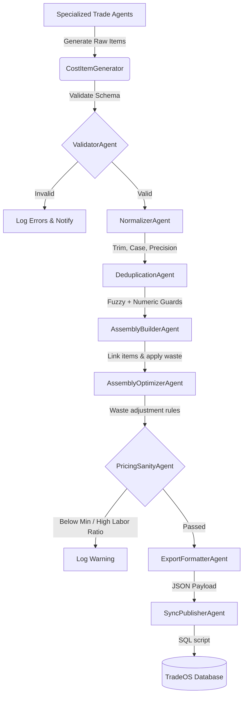

# TradeOS Construction Knowledge Engine

The TradeOS Construction Knowledge Engine is a framework designed to collect, refine, and maintain construction cost data. By leveraging multi-agent systems and deterministic validation rules, it translates raw, messy contractor estimates into structured, reliable, and relational cost databases.

## System Architecture

## Key Components

### 1. Cost Item & Assembly Generators (`pipelines/generation/`)
Specialized Python scripts representing individual agents for framing, concrete, HVAC, drywall, etc. These agents output cost records with fields for labor, material, equipment, and metadata.

### 2. Validation & Normalization Rules (`knowledge/validation-rules/`, `knowledge/normalization-rules/`)
Ensures data integrity. It enforces:
- Strict UUID structures.
- Allowed units (`SF`, `LF`, `EA`, `HR`, `CY`, `SQ`, `CF`).
- Standard casing (Title Case for names/categories, and Upper Case for units).
- Numeric precision (rounding all decimal values to exactly two decimal places).

### 3. Deduplication and Numeric Protection (`knowledge/deduplication/`)
Fuzzy string comparison (SequenceMatcher) with a threshold of `0.80`. To avoid false positives on legitimate variants (e.g. concrete PSI ratings, rebar numbers), a **Numeric-Variant Guard** ignores matches that only differ by numerical tokens. A secondary **Cost-Vector Guard** groups items that have the exact same unit, labor cost, and material cost, and a name similarity $\ge 0.75$.

### 4. Pricing Sanity Thresholds (`knowledge/pricing-sanity/`)
A dual-layer sanity check:
- **Unit Floors**: Absolute minimum costs permitted for each unit (e.g. $0.05 per SF, $12.00 per HR, $0.25 per EA).
- **Labor Ratio Check**: Flags any item with a labor ratio $> 98\%$, unless it is whitelisted using keywords like "inspection", "engineer", "permit", "management".

### 5. Relational Sync Pipeline (`pipelines/export/`)
Generates transaction-safe PostgreSQL code (`sync_final.sql`) that performs bulk upserts using CTEs and clear-and-replace line-item logic to synchronize cost items and assemblies while maintaining referential integrity.
