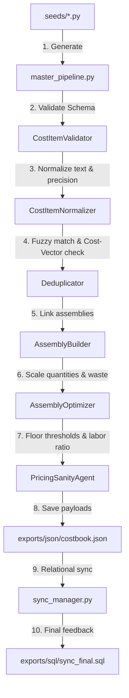

# TradeOS Construction Knowledge Engine - Architecture Specification

> **Path notice (2026-07-16):** the Directory Map below shows `knowledge/` one level shallower
> than it actually exists on disk. The real, loader-consumed path is `knowledge/knowledge/`
> (e.g. `knowledge/knowledge/trade-taxonomy/`, `knowledge/knowledge/validation-rules/`), not
> `knowledge/trade-taxonomy/`. This map also lists an `imports/` directory that does not exist in
> the current tree. See [`packages/knowledge-engine/README.md`](../README.md) for the current
> canonical structure and runtime-critical asset list. This file has not been rewritten — only
> this notice and the inline corrections below were added.

---

## 1. Purpose & Scope
The Knowledge Engine serves as the core system of record for construction costing logic, safety directives, permit rules, and material-equipment mappings. Its goal is to maintain a clean, machine-readable repository of construction expertise to feed estimators, LLM proposal generators, and production planning agents.

---

## 2. Directory Map

```
/
├── exports/                 # Migration-ready payloads for Supabase consumption
│   ├── json/                # Consolidated costbook JSON
│   └── sql/                 # SQL relational migration scripts
├── imports/                 # NOT PRESENT in the current tree — historical/aspirational only
├── knowledge/knowledge/     # Actual on-disk path (doubled) — rule files, indexes, taxonomies
│   ├── assemblies/          # Assembly templates and components
│   ├── cost-items/          # Master cost item JSON database
│   ├── validation-rules/    # Core validation guidelines
│   ├── trade-taxonomy/      # Trade and subcategory lists
│   └── reasoning/           # Logical decision models for AI agents
├── pipelines/               # Reorganized execution scripts
│   ├── master_pipeline.py   # System orchestrator
│   ├── generation/seeds/    # Base static trade seeds
│   └── export/              # SQL publishers and sync managers
├── prompts/                 # Core instructions and system cards for agents
└── schemas/                 # Versioned canonical JSON validation schemas
```

---

## 3. Pipeline Data Flow

The orchestrator operates in a linear, 10-step pipeline:



---

## 4. Future AI Architecture & Pipelines

### Import Flow
1. **Catalog Ingestion**: Legacy PDF/CSV files are placed in `imports/legacy/`.
2. **LLM Extraction**: An ingestion agent (using `prompts/agents/agent-legacy-importer.md`) parses details and outputs standardized JSON to `imports/staging/`.
3. **Staging Validation**: Staged files are run through schemas before loading into the main pipeline.

### Export Flow
1. **GitHub Actions Runner**: Triggered automatically on merge to `main`.
2. **Schema Test Suite**: Validates all items against `schemas/cost-item.schema.json` and rules.
3. **Production Deploy**: The SQL transaction is executed against the live Supabase instance, performing a safe, transactional relational sync.

---

## 5. Migration Strategy
1. **Local Sandbox Phase (Current)**: Refactor structural pipelines, extract rules to markdown, and lock down JSON schemas.
2. **Hybrid Testing Phase**: Run pipelines locally but connect `pipelines/export/publish_to_supabase.py` to a staging database.
3. **CI/CD Integration**: Remove local script triggers; move execution into a containerized serverless task running on a schedule or git hook.
