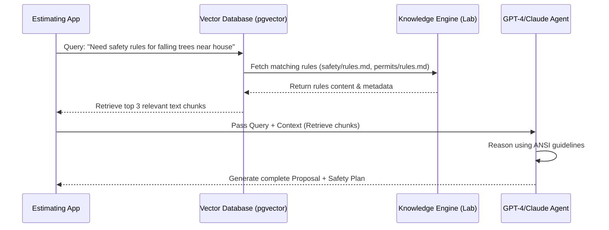

# TradeOS Knowledge Lab - Retrieval Architecture

This document describes how the TradeOS Knowledge Engine retrieval layer queries, matches, and presents costbook data to the runtime estimating application.

---

## 1. Search Modalities

### Keyword Search
* **Usage**: Flat text lookups on names and descriptions.
* **Mechanism**: PostgreSQL full-text search (`tsvector` / `tsquery`) and Elasticsearch. Matches terms like "rebar" or "drywall hanging".

### Taxonomy Lookup
* **Usage**: Grouping and filtering based on the hierarchy defined in `knowledge/trade-taxonomy/taxonomy.md`.
* **Mechanism**: Relational queries selecting all items where `category = 'Drywall'` or `subcategory = 'Removal'`. Prevents cross-trade noise.

### Semantic Search & Vector Search
* **Usage**: Querying when the estimator uses natural language that doesn't share keywords with the database (e.g. "cleanup storm debris" matching to emergency clearance).
* **Mechanism**:
  - Convert cost item names, descriptions, and assemblies into dense vector embeddings (e.g. using `text-embedding-3-small` or local Hugging Face sentence-transformers).
  - Perform Cosine Similarity or Inner Product search in a vector database (e.g. pgvector in Supabase) to find the nearest neighbor ($K$-NN) matches.

---

## 2. Dynamic Matching Workflows

### Cost-Item Matching Flow
1. User provides raw text: *"I need 500 feet of wood fencing."*
2. **Entity Extraction**: Extract `quantity = 500`, `unit = LF`, `material = wood`, `task = fencing`.
3. **Taxonomy Filter**: Filter search database to `category = 'Fence'`.
4. **Vector Query**: Search vectors in that subset for the term "wood fence".
5. **Score & Bind**: Bind to the closest item `Wood Fence Install - Standard` (UUID) with high confidence.

### Assembly Matching Flow
1. User requests a complete job: *"Replace standard bathroom floor tiles."*
2. **Context Resolution**: The engine pulls the linked assemblies in `knowledge/assembly-index.json`.
3. **Semantic Ranker**: Rank candidate assemblies by cosine similarity.
4. **Parameter Bind**: Prompt the user for dimensions (e.g., area size in SF).
5. **Output Generation**: Return the assembly `Master Bathroom Full Build - 100 SF` with scaled line item quantities based on the inputs.

---

## 3. Future Embeddings & RAG Workflow

The future Retrieval-Augmented Generation (RAG) loop is designed as follows:

By storing all data, schemas, and rules in simple, machine-readable JSON and Markdown files, the TradeOS Knowledge Lab ensures that future LLM agents can easily parse the entire repository, perform fast contextual searches, and generate highly accurate estimators.
