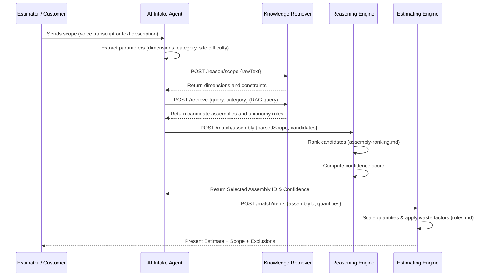

# TradeOS Knowledge Engine - Runtime Architecture

This document maps out the execution sequences and interfaces that connect intake parsing, knowledge retrieval, pricing reasoning, and estimating.

---

## 1. System Communication Map

```
                  ┌──────────────────────┐
                  │ Customer Intake (AI) │
                  └──────────┬───────────┘
                             │ (Parsed parameters)
                             ▼
                  ┌──────────────────────┐
                  │  Knowledge Retriever │
                  └──────────┬───────────┘
                             │ (Filtered candidates & rules)
                             ▼
                  ┌──────────────────────┐
                  │   Reasoning Engine   │
                  └──────────┬───────────┘
                             │ (Confidence scores & matches)
                             ▼
                  ┌──────────────────────┐
                  │    Assembly Matcher  │
                  └──────────┬───────────┘
                             │ (Selected Assembly ID)
                             ▼
                  ┌──────────────────────┐
                  │   Cost Item Matcher  │
                  └──────────┬───────────┘
                             │ (Linked unit cost items)
                             ▼
                  ┌──────────────────────┐
                  │  Proposal Generator  │
                  └──────────┬───────────┘
                             │ (Generated scope & terms)
                             ▼
                  ┌──────────────────────┐
                  │   Estimating Engine  │
                  └──────────────────────┘
```

---

## 2. Sequence Diagram


