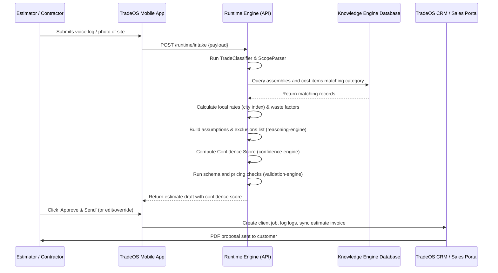

# TradeOS Estimating App - Runtime Pipeline Specification

This document outlines the real-time processing sequence that transforms customer input into formatted estimates and CRM records.

---

## 1. Runtime Pipeline Sequence

```
User Input (Voice, Photo, PDF, Text)
       │
       ▼
[AI Intake Layer] ──► Parse & extract parameters
       │
       ▼
[Trade Classifier] ──► Scopes trade category
       │
       ▼
[Retrieval & Matching] ──► Cosine/trigram search of assemblies & cost items
       │
       ▼
[Pricing Engine] ──► Apply regional multipliers and waste factor additions
       │
       ▼
[Reasoning Engine] ──► Formulate assumptions, exclusions, and warranty terms
       │
       ▼
[Confidence Scorer] ──► Score estimate certainty
       │
       ▼
[Validation Engine] ──► Schema and sanity constraints check
       │
       ├─────────────────────────┐
       ▼ (Confidence >= 0.85)    ▼ (Confidence < 0.85)
[Automatic Approval]      [Human Staging Review]
       │                         │ (Contractor override / edit)
       └──────────┬──────────────┘
                  ▼
         [Proposal Draft]
                  │
                  ▼
          [PDF Generator]
                  │
                  ▼
            [CRM Record]
```

---

## 2. Sequence Diagram


