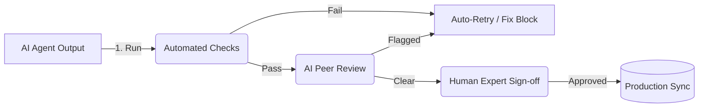

# TradeOS Construction Knowledge Engine - Validation Strategy

This document details the multi-stage quality assurance (QA) strategy to ensure all generated cost items, assemblies, and associated metadata satisfy production quality metrics before deployment.

---

## 1. Automated Pipeline Validation Layers

### Step 1: Schema Validation
* **Tool**: Python `jsonschema` library.
* **Checks**: Every new item must validate against [cost-item.schema.json](file:///Users/showb/TradeOS%20Costbook%20Editor/schemas/cost-item.schema.json). Every assembly must validate against [assembly.schema.json](file:///Users/showb/TradeOS%20Costbook%20Editor/schemas/assembly.schema.json).
* **Failure Condition**: Any missing required property, invalid UUID format, or invalid unit code halts the deployment.

### Step 2: Duplicate Detection
* **Tool**: Python deduplicator with fuzzy similarity algorithms.
* **Checks**:
  - Fuzzy string match ratio $> 0.80$ for items in the same category.
  - Identical unit and labor/material cost matching (cosine similarity of costs) with name similarity $> 0.75$.
* **Exclusions**: The **Numeric-Variant Guard** excludes items from deduplication if they differ by numeric parameters (e.g. `2x4` vs `2x6` or `3000 PSI` vs `4000 PSI`).

### Step 3: Pricing Sanity
* **Tool**: Threshold comparison module.
* **Checks**:
  - Checks if total cost is below unit-specific floors (e.g. $0.05/SF, $12.00/HR).
  - Checks if the labor-to-total cost ratio exceeds $98\%$ (unless the item name contains whitelisted keywords representing services or inspections).

### Step 4: Taxonomy Validation
* **Tool**: Categorization matches.
* **Checks**: Verify that the item's `category` and `subcategory` exist in the canonical list defined in [taxonomy.md](file:///Users/showb/TradeOS%20Costbook%20Editor/knowledge/trade-taxonomy/taxonomy.md). Prevents spelling typos from writing invalid categories to the production database.

### Step 5: Proposal Language Validation
* **Tool**: Template parser checks.
* **Checks**: Verify that all assembly records include non-empty, professional strings for `proposalScopeOfWork`, `proposalAssumptions`, `proposalExclusions`, and `warrantyLanguage`.

---

## 2. Review Workflows (Human-in-the-Loop)

### AI Peer Review
- A separate LLM (acting as the QA Auditor or Expert Arborist/Contractor Advisor) reads the rules and generated items.
- It performs a qualitative check: *Are these prices realistic for this trade? Are there missing dependencies in the proposal exclusions?*
- If the reviewer flags anomalies, the item is sent back to the generating agent with feedback.

### Human Review
- Items and assemblies that pass all automated and AI audits are presented in a staging dashboard or draft migration file.
- A TradeOS product manager or senior construction estimator reviews the changes and executes the final commit or database sync.
